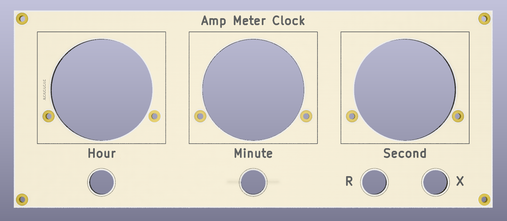

Front panel for Ammeter Clock project. Intended to be made into an aluminum PCB.

Main project link here: [https://github.com/Sirawit7205/ampmeter-clock](https://github.com/Sirawit7205/ampmeter-clock)

This project is licensed under `SPDX-License-Identifier: CERN-OHL-S-2.0`

